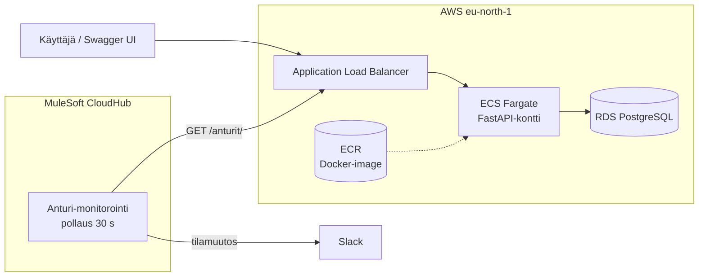
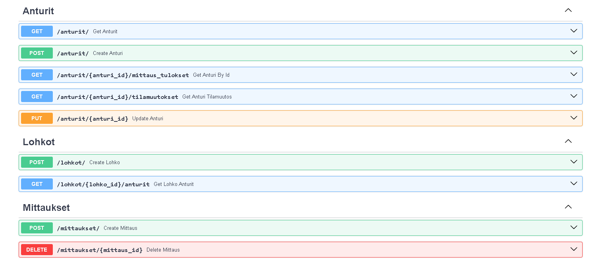

# Anturi API

REST API lämpötila-antureiden datan keräämiseen ja hallintaan. Antureita hallitaan lohkoittain, mittauksia voi hakea aikavälillä, ja anturin tilamuutoksista jää historia.

Aloitin projektin kurssin päättötyönä, jossa tehtävänä oli rakentaa REST API. Kaikki sen jälkeen on omaa jatkokehitystäni, ei osa kurssia: lisäsin testit, kontitin sovelluksen, deployasin sen AWS:ään ja rakensin päälle MuleSoft-integraation, joka hälyttää Slackiin. Seuraavaksi rakennan infran Terraformilla ja CI/CD-putken GitHub Actionsilla. Tavoitteena on viedä yksi API koko matkan läpi: **rakennettu → testattu → kontitettu → deployattu → integroitu**.



## Miksi rakensin sen näin

**Tietomalli ensin paperilla.** Hahmottelin resurssit ja niiden suhteet (Lohko → Anturi → Mittaus) paperille ennen koodia. Endpointit seuraavat samaa rakennetta, esim. `/lohkot/{id}/anturit` ja `/anturit/{id}/mittaus_tulokset`, joten API on ennustettava: kun tuntee yhden resurssin polun, arvaa muutkin.

**Tilamuutokset historiaksi, ei pelkäksi kentäksi.** Anturin nykyinen tila ei kerro, milloin vika alkoi tai kuinka usein anturi on ollut virhetilassa. Siksi jokainen tilamuutos kirjataan omaksi rivikseen, mutta vain kun tila oikeasti muuttuu, jotta historiaan ei kerry toistoa. Sama periaate toimii myöhemmin MuleSoft-integraatiossa.

**SQLite kehityksessä, PostgreSQL muualla.** Tietokanta valitaan `DATABASE_URL`-ympäristömuuttujalla, joten sama koodi toimii paikallisesti ilman asennuksia, Docker Composessa ja AWS:n RDS:ssä. Koodiin ei tarvitse koskea ympäristöä vaihtaessa.

**AWS, vaikka edellinen projektini oli GCP:ssä.** Book API pyöri GCP:n virtuaalikoneella. Tähän halusin toisen pilven ja konttipohjaisen ajon, joten valitsin ECS Fargaten: ei palvelimia ylläpidettäväksi, ja RDS hoitaa PostgreSQL:n.

**Load balancer ECS:n eteen.** Fargate-tehtävän IP vaihtuu joka deployssa. MuleSoft-integraatio tarvitsi pysyvän osoitteen, ja ALB antoi sen. Samalla sain health checkin.

**MuleSoft-integraatio.** Halusin APIlle oikean käyttäjän, en pelkkää `/docs`-sivua. Integraatio pollaa anturien tilaa ja lähettää Slackiin hälytyksen vain, kun tila oikeasti muuttuu. Se on sama ongelma kuin oikeissa valvontajärjestelmissä: hälytysten pitää olla harvinaisia ja merkityksellisiä.

**Terraform (seuraavaksi).** AWS-ympäristö oli rakennettu konsolista klikkaamalla. Kun purin sen kustannussyistä, sen uudelleenrakentaminen olisi pitänyt tehdä taas käsin ja muistinvaraisesti, ja käsin rakentaessa pienikin virhe, kuten väärä security group -sääntö, voi kaataa koko ympäristön. Siksi seuraava askel on kirjoittaa infra koodiksi: ympäristö pystytetään ja puretaan yhdellä komennolla, ja jokainen muutos näkyy versionhallinnassa. Valitsin Terraformin, koska infrastruktuuri koodina on taito, jota pilvi- ja integraatiorooleissa kysytään yhä useammin.

**GitHub Actions (seuraavaksi).** Nyt testit ajetaan ja image pushataan käsin. Haluan rakentaa putken, joka vie koodin kehityksestä tuotantoon kuten oikeassa tiimissä: ensimmäisenä testit ajetaan automaattisesti jokaisesta pushista, jotta rikkinäinen koodi jää kiinni ennen kuin se etenee. Sen jälkeen putki rakentaa Docker-imagen ECR:ään ja deployaa sen ECS:ään. CI/CD on taito, jonka haluan hallita pitkällä tähtäimellä, ja tämä projekti on siihen sopiva paikka.

## Mitä opin matkan varrella

- **Tilat Enumiksi.** Aluksi anturin tilaksi kelpasi mikä tahansa merkkijono, myös "Banaani". Enumilla sallitut tilat lukittiin, jolloin virheellinen arvo hylätään jo validoinnissa ja API:n vastaukset ovat ennustettavia.
- **Response-mallit useammasta kyselystä.** Opin rakentamaan omia vastausmalleja (esim. `AnturiMittausResponse`), joilla yksi endpoint palauttaa yhdistettyä dataa useasta taulusta, esim. anturin tiedot ja sen mittaukset samassa vastauksessa.
- **Ensimmäinen deploy kaatui**, koska DATABASE_URL-ympäristömuuttujaan oli jäänyt vahingossa kulmasulkeet. Opin lukemaan ECS-tehtävien lokit ja tekemään korjauksen uutena task definition -revisiona.
- **API ei vastannut ulospäin**, vaikka kontti oli käynnissä. Vika oli ALB:n security groupissa, joka ei sallinut julkista HTTP-liikennettä. Verkkokerros kannattaa tarkistaa ennen sovelluskoodia.
- **Mule-flow ei muista mitään pollausten välillä.** Tilanvertailua varten tarvitsin Object Storen.

## Tilanne nyt

- [x] API, testit, Docker ja PostgreSQL
- [x] AWS-deploy (ECR → ECS Fargate → RDS, ALB edessä). Toimi, purettu kustannussyistä.
- [x] MuleSoft-integraatio CloudHubissa. Toimi AWS-ympäristön kanssa, pysäytetty kunnes infra on rakennettu uudelleen.
- [ ] AWS-infra koodiksi Terraformilla
- [ ] CI/CD GitHub Actionsilla

## Ominaisuudet

- Tietomalli: **Lohko → Anturi → Mittaus**
- Antureiden, lohkojen ja mittausten CRUD
- Tilamuutosten automaattinen kirjaus (sama tila uudelleen ei luo turhaa merkintää)
- Mittausten aikavälisuodatus (`start_time`, `end_time`) ja paginointi (`page`, `limit` ≤ 100)
- Virhetilassa olevan anturin mittauksia ei palauteta (409)

```
GET /anturit/{anturi_id}/mittaus_tulokset?page=1&limit=10
```

```json
{
  "anturi": {
    "id": 1,
    "anturi_name": "Anturi 32",
    "lohko_id": 1,
    "tila": "error"
  },
  "mittaukset": [
    {
      "id": 1,
      "anturi_id": 1,
      "mittaus_arvo": 20.5,
      "aikaleima": "2026-04-02T10:31:26.623000"
    }
  ]
}
```

## Testit

Pytest + FastAPI TestClient. Testit kattavat onnistuneiden polkujen lisäksi virhetilanteet: olemattomat resurssit (404), virheelliset aikavälit ja paginoinnin rajat, tilamuutoshistorian ja virhetilassa olevan anturin käsittelyn.

```bash
python -m pytest -v
```

## Aja paikallisesti

**Docker Composella (PostgreSQL)**, suositeltu:

```bash
docker compose up -d --build
```

**Ilman Dockeria (SQLite):**

```bash
python -m venv .venv
.venv\Scripts\activate          # Windows
pip install -r requirements.txt
uvicorn app.main:app --reload
```

Käynnistyksen jälkeen API-dokumentaatio löytyy osoitteesta `http://localhost:8000/docs`.


## MuleSoft-integraatio

Erillinen Anypoint-projekti, joka on deployattu CloudHubiin.

```
Scheduler (30 s) → GET /anturit/ → DataWeave
→ For Each anturi → Object Store: edellinen tila
→ normal → error:  Slack ALERT
→ error → normal:  Slack RECOVERY
→ ei muutosta:     ei viestiä
→ Object Store: tallenna nykyinen tila
```

Slack-viestit lähtevät Incoming Webhookilla.

```
ALERT: Anturi PannuHuone (id: 2, lohko: 2) meni error-tilaan!
RECOVERY: Anturi PannuHuone (id: 2, lohko: 2) palautui normal-tilaan!
```

## Rakenne

```text
app/
├── main.py
├── routes/       # endpointit
├── models/       # SQLModel-mallit
├── crud/         # tietokantaoperaatiot
├── database/     # DB-alustus
└── tests/        # pytest-testit
compose.yaml      # API + PostgreSQL paikallisesti
Dockerfile
requirements.txt
pytest.ini
```

## Teknologiat

Python · FastAPI · SQLModel · PostgreSQL · SQLite · pytest · Docker · AWS (ECR, ECS Fargate, RDS, ALB) · Terraform · MuleSoft (Anypoint, DataWeave, CloudHub) · Slack
